# 中山大学数据科学与计算机学院本科生实验报告

<center><b>(2019年秋季学期)</b></center>

## gihub链接

https://github.com/CHIM0/Blockchain_final_homework


课程名称： 区块链原理与技术

任课教师：郑子彬

|     年级     | 17级            | 专业（方向） | 软件工程                 |
| :----------: | :-------------- | :----------: | ------------------------ |
|   **学号**   | **17343042**    |   **姓名**   | **洪燊**                 |
|   **电话**   | **13686133112** |  **Email**   | **hs.chimo@foxmail.com** |
| **开始日期** | **12月8日**     | **完成日期** | **12月12日**             |

[TOC]


## 项目背景

某车企（宝马）因为其造车技术特别牛，消费者口碑好，所以其在同行业中占据绝对优势
地位。因此，在金融机构（银行）对该车企的信用评级将很高，认为他有很大的风险承担的 能力。在某次交易中，该车企从轮胎公司购买了一批轮胎，但由于资金暂时短缺向轮胎公司 签订了 1000 万的应收账款单据，承诺 1 年后归还轮胎公司 1000 万。这个过程可以拉上金 融机构例如银行来对这笔交易作见证，确认这笔交易的真实性。在接下里的几个月里，轮胎 公司因为资金短缺需要融资，这个时候它可以凭借跟某车企签订的应收账款单据向金融结构 借款，金融机构认可该车企（核心企业）的还款能力，因此愿意借款给轮胎公司。但是，这 样的信任关系并不会往下游传递。在某个交易中，轮胎公司从轮毂公司购买了一批轮毂，但 由于租金暂时短缺向轮胎公司签订了 500 万的应收账款单据，承诺 1 年后归还轮胎公司 500 万。当轮毂公司想利用这个应收账款单据向金融机构借款融资的时候，金融机构因为不认可 轮胎公司的还款能力，需要对轮胎公司进行详细的信用分析以评估其还款能力同时验证应收 账款单据的真实性，才能决定是否借款给轮毂公司。这个过程将增加很多经济成本，而这个 问题主要是由于该车企的信用无法在整个供应链中传递以及交易信息不透明化所导致的。

## 方案设计

### 区块链如何解决这个问题
由于区块链不可修改的特性,以及智能合约运行内容不可篡改且记录的特性,可以很方便的查找到可信任的账单信息,从而让小公司可以使用欠债方为大公司的债券而在银行进行融资或者使用债券转让的方式去购买其他公司的产品.而在智能合约中只需要设计一个债券系统,让小公司能使用债券向另一个公司购买产品,同时这另一个公司持有的债券的欠款方不是这个小公司,而是这个小公司持有的债券的大公司欠款方.这样就能实现信用的传递,同时债权人和欠款人的信息都可以很方便的查看和管理.

### 方案内容

1. 智能合约设计

2. 链端合约部署

3. 后端以及API接口设计

4. 前端界面设计

#### 1. 智能合约设计

##### 对象功能设计和功能约束

系统由很多个公司company组成,其中有1个银行公司,其他都为普通公司,两者能使用的函数不同.
- 银行
    - 发行货币:即给某个公司发钱
    - 公司查询:查看指定公司的信息,公司金钱等,公司名字,公司地址,公司类型等
- 公司
    - 公司注册,需要不重复的公司名称作为公司的唯一标识,以及初始资金
    - 公司转账,将__自己__公司的钱转账给别的公司
    - 查看__自己__公司信息
    - 查看__自己__公司的账单信息
    - 创建账单,只能创建欠款人为__自己__的账单(避免滥用)
    - 账单转移,只能转移债权人为__自己__的账单
    - 偿还账单,只能偿还欠款人为__自己__的账单
    - 向银行融资,只能使用欠款人为__自己__的账单向银行申请融资

同时银行也以公司的形式进行管理,因此也可以使用除了向银行融资这一功能的其他公司可以使用的函数.

##### 合约详细内容

合约代码`./src/bank.sol`中的注释已经挺详细的,因此只说明关键代码.
###### 事件

```
    // 货币发行
    event Issue(string companyName,uint amount);
    // 公司查询
    event Check(string companyName, address companyAddr, uint companyMoney, uint compantType);
    // 新公司创建
    event Register(string companyName);
    //账单变更事件
    event ReceiptCreate(string from,string to, uint amount, bool isAdd);
    //账单打印
    event showReceiptEvent(string from, string to, uint amount, bool isEvidence);
    //通用错误事件
    event errEvent(string errMessage);
    //转账事件
    event SendEvent(string fromCompany, string toCompany, uint amount);
```
其中通用错误事件用来提示操作者操作出错的错误信息。

###### 数据结构

存储工厂数据的结构体:
```
struct company{
    string companyName;
    address companyAddr;
    uint companyType;//0为银行，1为普通公司
    uint companyMoney;//初始为0
}
```
存储账单数据的结构体,保存了账单的欠款方，债权人，款项数目以及是否被银行确认的信息：
```
    struct receipt{
        address from;
        address to;
        uint mount;
        bool isEvidence;
    }
```
私有映射,用来存储用户对应的公司名字，公司名字对应的公司数据结构以及公司名字对应的账单数据结构：
```
    //地址到工厂名的映射
    mapping(address => string) companyNames;
    //工厂名到工厂实例的映射
    mapping(string => company) companys;
    //工厂名字到账单的映射
    mapping(string => receipt[]) receipts;
```
由于使用公司名字进行公司的唯一标识，因此需要地址到公司名字的映射。
同时设立共有变量`bankAddr`和`bankName`公开银行的公钥地址和银行名字。

###### 功能函数

智能合约初始化：
```
    constructor(uint initbankMoney,string initbankName){
        bankAddr = msg.sender;
        bankName = initbankName;
        companyNames[bankAddr] = bankName;
        //将银行加入到公司列表
        companys[bankName] = company({
            companyName:bankName,
            companyAddr:bankAddr,
            companyType:0,
            companyMoney:initbankMoney
        });
    }
```
智能合约的初始化也就是银行这个公司注册的过程，因此要将银行加入到公司映射中去，并初始化银行信息的共有变量。

银行发行货币函数以及银行查看公司信息：
```
    //虚拟货币发行
    function issue(string companyName, uint amount) public {
        if (msg.sender != bankAddr) {
            emit errEvent("Only bank can issue money.");
            return;
        }
        companys[companyName].companyMoney += amount;
        emit Issue(companyName, amount);
    }
    //银行查看公司信息
    function bankQueryCompany(string companyName) public {
        if (msg.sender != bankAddr) {
            emit errEvent("Only bank can query other company's message.");
            return;
        }
        emit Check(companys[companyName].companyName, companys[companyName].companyAddr, companys[companyName].companyMoney, companys[companyName].companyType);
    }
```
关键在于检查用户是否为用户，若不为银行则输出提示信息并取消操作。

公司注册函数，需要输入公司名字以及公司启动资金：
```
    //公司注册
    function companyRegister(string companyName, uint initCompanyMoney) public {
        if(bytes(companyNames[msg.sender]).length != 0){
            emit errEvent("You have already regist a company.");
            return;
        }
        if(initCompanyMoney < 10) {
            emit errEvent("You have no enough initMoney(>10).");
            return;
        }
        if(bytes(companys[companyName].companyName).length != 0) {
            emit errEvent("The company name has been used.");
            return;
        }
        companys[companyName] = company({
            companyName:companyName,
            companyAddr:msg.sender,
            companyType:1,//普通公司标识
            companyMoney:initCompanyMoney
        });
        companyNames[msg.sender] = companyName;
        emit Register(companyName);
    }
```
注册公司注意要检查公司名的唯一性，以及用户名下是否以及创建了公司，若已经创建了公司则不能创建，同时用户在做出其他所有操作时，都会检查当前用户名下是否有公司，若没有公司都会取消操作并提示错误信息。

打印账单（只能查看自己的账单）：
```
    function showMyReceipt() public {
        for(uint i = 0; i < receipts[companyNames[msg.sender]].length; i++){
            receipt storage temp = receipts[companyNames[msg.sender]][i];
            if(temp.mount == 0) continue;
            emit showReceiptEvent(
                companyNames[temp.from],
                companyNames[temp.to],
                temp.mount,
                temp.isEvidence
            );
        }
    }
```
使用简单的for循环即可。

###### 4个主要功能（创建账单，账单转移，向银行融资，偿还账单）

创建账单：

```
    function createReceipt(string toCompany, uint amount) public {
        string storage fromCompany = companyNames[msg.sender];
        address toAddr = companys[toCompany].companyAddr;
        if(bytes(fromCompany).length == 0){
            emit errEvent("Your company doesn't existed.");
            return;
        }
        if(bytes(companys[toCompany].companyName).length == 0){
            emit errEvent("The company doesn't exited.");
            return;
        }
        _createReceipt(msg.sender, toAddr, amount, true);
    }
```
设计上创建账单只能由欠款方创建，这样比较合理,其中的_createReceipt私有函数为使用地址创建账单的函数，同名共有函数的主要任务是检查操作的合法性。
_creatReceipt:
```
    function _createReceipt(address fromAddr, address toAddr, uint amount, bool isAdd) private returns (bool ok){
        //判断是否存在相同双方的账单
        //若存在则更新双方账单内容
        string storage fromCompany = companyNames[fromAddr];
        string storage toCompany = companyNames[toAddr];
        bool sameReceiptExist = false;
        for(uint i = 0; i < receipts[fromCompany].length; i++){
            receipt storage temp = receipts[fromCompany][i];
            if(temp.mount != 0 && temp.from == fromAddr && temp.to == toAddr){
                sameReceiptExist = true;
                if(isAdd){
                    receipts[fromCompany][i].mount += amount;
                }else if(!isAdd && receipts[fromCompany][i].mount >= amount){
                    receipts[fromCompany][i].mount -= amount;
                }else{
                    emit errEvent("The money doesn't enough to transfer.");
                    return false;
                }
            }
        }
        if(sameReceiptExist){
            for(i = 0; i < receipts[toCompany].length; i++){
                temp = receipts[toCompany][i];
                if(temp.mount != 0 && temp.from == fromAddr && temp.to == toAddr){
                    if(isAdd){
                        receipts[toCompany][i].mount += amount;
                    }else if(!isAdd && receipts[toCompany][i].mount >= amount){
                        receipts[toCompany][i].mount -= amount;
                    }else{
                        emit errEvent("The money doesn't enough to transfer.");
                        return false;
                    }
                }
            }
            emit ReceiptCreate(fromCompany, toCompany, amount, isAdd);
            return true;
        }else{
            if(isAdd){
                receipts[fromCompany].push(receipt({
                    from:fromAddr,
                    to:toAddr,
                    mount:amount,
                    isEvidence:false
                }));
                receipts[toCompany].push(receipt({
                    from:fromAddr,
                    to:toAddr,
                    mount:amount,
                    isEvidence:false
                }));
                emit ReceiptCreate(fromCompany, toCompany, amount, isAdd);
                return true;
            }
            else{
                emit errEvent("the target receipt doesn't exited.");
                return false;
            }
        }
    }
```
`_createReceipt`函数的参数为欠款方地址，债权人地址，款项数目，以及是减去款项还是加上款项，这么设计可以方便之后其他功能的实现。函数首先要检查双方的账单内容，若存在同样的from和to的账单条目则直接在其上进行款项数目的加减操作（注意减法要避免结果小于0），若不存在相应条目，对于加法来说，就新建一个账单即可，而对于减法来说，若不存在对应条目则失败。

账单转移：
```
    function transferReceipt(string fromCompany, uint amount, string newToCompany) public{
        string storage toCompany = companyNames[msg.sender];
        address fromAddr = companys[fromCompany].companyAddr;
        address newToAddr = companys[newToCompany].companyAddr;
        if(bytes(toCompany).length == 0) {
            emit errEvent("Your company doesn't existed.");
            return;
        }
        if(bytes(companys[fromCompany].companyName).length == 0) {
            emit errEvent("The fromCompany doesn't existed.");
            return;
        }
        if(bytes(companys[newToCompany].companyName).length == 0) {
            emit errEvent("The toCompany doesn't existed.");
            return;
        }
        _transferReceipt(fromAddr,msg.sender,newToAddr,amount);
    }
```
账单的转移要检查的内容比较多，需要检查本人是否有公司，然后自己的公司是否有指定欠款人的账单，同时要检查转移到的公司是否存在，然后再调用`_transferReceipt`函数进行正式的账单转移。
_transferReceipt:
```
    function _transferReceipt(address from,address to,address newTo, uint amount) private returns(bool ok){
        if(_createReceipt(from,to,amount,false)){
            if(_createReceipt(from,newTo,amount,true)){
                return true;
            }
        }
        return false;
    }
```
账单转移实际上就是减去自己的账单，同时新建一个债权人为转移方的新账单，因此调用两次_createReceipt即可。

向银行融资：
```
    //向银行融资,账单收款方（to）可使用
    function bankFinancing(string fromCompany, uint amount)public{
        string storage toCompany = companyNames[msg.sender];
        address fromAddr = companys[fromCompany].companyAddr;
        if(bytes(toCompany).length == 0) {
            emit errEvent("Your company doesn't existed.");
            return;
        }
        if(bytes(companys[fromCompany].companyName).length == 0) {
            emit errEvent("The fromCompany doesn't existed.");
            return;
        }
        if (_transferReceipt(fromAddr, msg.sender, bankAddr, amount)){
            _send(bankName,toCompany,amount);
        }else{
            emit errEvent("Finacing fail.");
        }
    }
```
实际上就是将账单转移给银行，再转移成功的前提下，银行转账给自己相应的款项。

偿还账单：
```
    //偿还账单,由from方偿还
    function payBack(string toCompany, uint amount) public {
        string storage fromCompany = companyNames[msg.sender];
        address toAddr = companys[toCompany].companyAddr;
        if(bytes(fromCompany).length == 0){
            emit errEvent("Your company doesn't existed.");
            return;
        }
        if(bytes(companys[toCompany].companyName).length == 0){
            emit errEvent("The company doesn't exited.");
            return;
        }
        if(_send(fromCompany, toCompany, amount)){
            _createReceipt(msg.sender, toAddr, amount, false);
        }
    }
```
设计上只能由欠款方使用该函数，实际上就是使用创建账单函数，将isAdd设置为false即可（即减去账单中的款项），要注意不能减得小于0，同时要记得检查操作的合法性。

#### 2. 链端合约部署

链的搭建使用WEBASE快速启动项目中自带的fisco-bcos快速建链脚本搭建，节点启动方法：

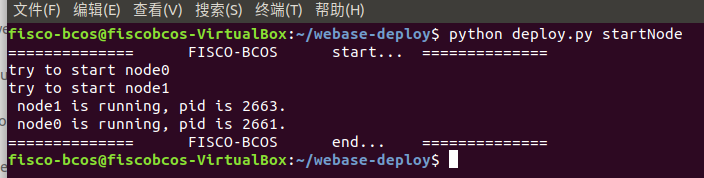


链端合约部署使用WEBASE用户界面提供的方法编译并部署（使用WEB3JDK部署总是提示gas不足，调整gaslimit等方式都没成功，因此还是采用webase用户界面提供的合约部署方式部署合约）

且链为本地私有链，即允许在127.0.0.1端口以方便本机调试使用。

#### 3. 后端以及API接口设计

后端项目结构(采用Spring框架进行包管理）:

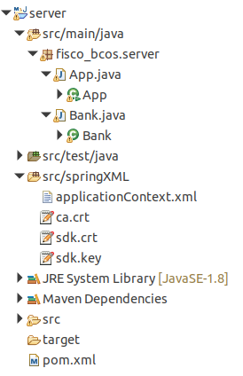

其中类App为后端服务器应用，类Bank为编译的合约类。

后端采用JAVASDK与链端进行交互，同时使用JAVA提供的httpServer包处理http请求。

JAVASDK的初始化：

```java
    public static void init() throws Exception
    {
           //读取配置文件，SDK与区块链节点建立连接
        context = new ClassPathXmlApplicationContext("classpath:applicationContext.xml");
        
        service = context.getBean(Service.class);
        service.run();
        channelEthereumService = new ChannelEthereumService();
        channelEthereumService.setChannelService(service);
        
        //获取Web3j对象
        web3j = Web3j.build(channelEthereumService, service.getGroupId());
    }
```

http服务框架及API设计：

```java
//run server
HttpServer server = HttpServer.create(new InetSocketAddress(post), 0);
server.createContext("/api/login", new requestHandler("login"));//finish
server.createContext("/api/regist", new requestHandler("regist"));//finish
server.createContext("/api/bank/issue", new requestHandler("bank/issue"));
server.createContext("/api/bank/queryCompany", new requestHandler("bank/queryCompany"));
server.createContext("/api/company/send", new requestHandler("company/send"));//finish
server.createContext("/api/company/showMyReceipt", new requestHandler("company/showMyReceipt"));//
server.createContext("/api/company/createReceipt", new requestHandler("company/createReceipt"));
server.createContext("/api/company/transferReceipt", new requestHandler("company/transferReceipt"));
server.createContext("/api/company/bankFinancing", new requestHandler("company/bankFinancing"));
server.createContext("/api/company/payBack", new requestHandler("company/payBack"));
server.start();
System.out.println("Server listening on localhost:"+post);
```

API:

- [POST] /api/login: 登陆
- [POST] /api/regist: 注册
- [POST] /api/bank/issue: 银行货币发行 
- [POST] /api/bank/queryCompany: 银行查看某公司信息
- [POST] /api/company/send: 公司转账
- [POST] /api/company/showMyReceipt: 公司查看自己的账单（含欠债和外债） 
- [POST] /api/company/createReceipt: 创建账单
- [POST] /api/company/transferReceipt: 账单转移
- [POST] /api/company/bankFinancing: 向银行融资
- [POST] /api/company/ payBack: 偿还欠款

对于请求的身份验证，每个请求都需要传入自己的私钥作为token来验证请求的真实性，一定程度上确保操作的安全。

前端post的数据格式为x-www-form-urlencoded，经过后端处理为map数据类型，后端再根据收到的参数去调用合约函数，最后以json格式返回合约调用结果给前端，由于合约通过event来表示合约调用结果，因此需要用到JAVASDK中对于logs的解析函数。

后端请求处理样例（注册公司请求）：

```java
case "regist":
    if(requestMethod.equalsIgnoreCase("POST")) {
        String postString = IOUtils.toString(exchange.getRequestBody());
        System.out.println(postString);
        //x-www-form-urlencoded格式数据解析
        Map<String,String> postInfo = formData2Dic(postString);
        String privateKey = postInfo.get("privateKey");
        String companyName = postInfo.get("companyName");
        String initCompanyMoney_S = postInfo.get("initCompanyMoney");
		//请求参数存在性检查
        if(privateKey==null || companyName == null || initCompanyMoney_S == null) {
            break;
        }
        BigInteger initCompanyMoney = new BigInteger(initCompanyMoney_S,10);
		//根据参数调用合约函数并用私钥签名
        credentials = GenCredential.create(privateKey); 
        contract = Bank.load(contractAddr, web3j, credentials, new StaticGasProvider(gasPrice, gasLimit));
        try {
            //合约函数调用
            TransactionReceipt transactionReceipt = contract.companyRegister(companyName, initCompanyMoney).send();
            TransactionDecoder txDecodeSampleDecoder = TransactionDecoderFactory.buildTransactionDecoder(abi, "");
            List<Log> logs = transactionReceipt.getLogs();
            //log解析为json返回给前端
            String eventResult = txDecodeSampleDecoder.decodeEventReturnJson(logs);
            response = eventResult;
        }catch(Exception ex) {
            //若捕捉到错误返回false给前端
            response = "{\"ok\":false}";
            System.out.println(ex);
        }
    }
    break;
```

其他请求的处理类似，详情见src中的后端代码

#### 4. 前端界面设计

##### 前端架构

前端项目结构：

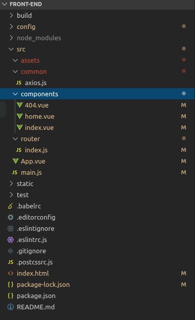

前端为vue+webpack搭建的单页应用，包含公司注册，登陆界面以及公司主页，其中公司主页包含多个功能标签页，以方便直观的使用多种功能。

前端使用命令:

`npm install` 安装依赖

`npm run dev` 启动前端项目

##### 前端页面展示

登陆：


注册：


我的公司:

含公司名称信息，公司链上地址信息，公司余额

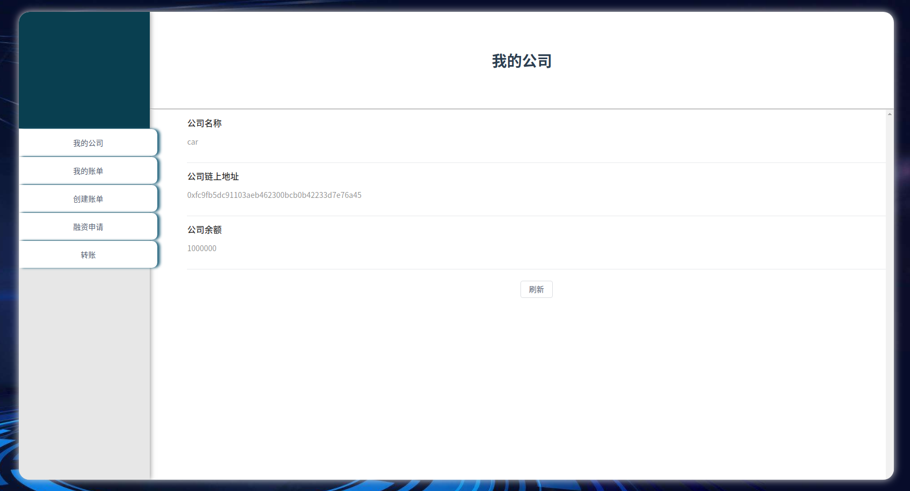

我的账单：

展示账单欠款（欠款和外债），对于欠款，提供还款按钮以输入款项还款，对于外债，则提供转移账单按钮对账单进行转移

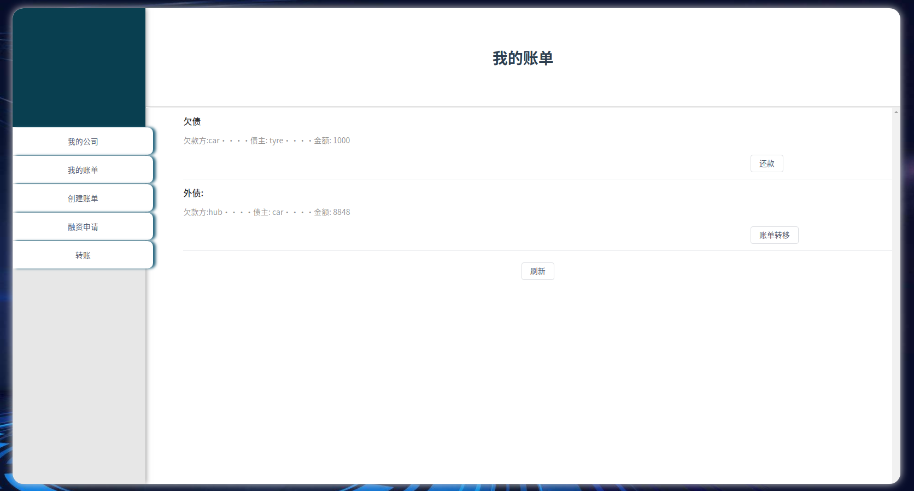

账单转移：

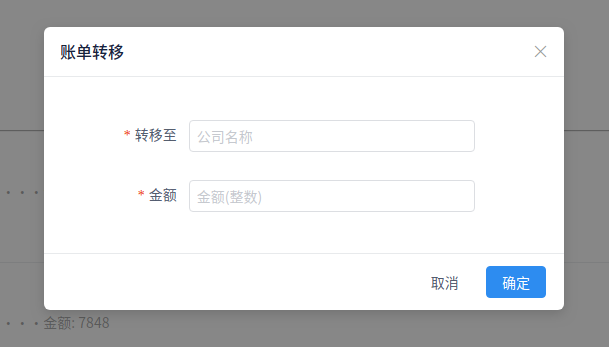

还款：


创建账单：

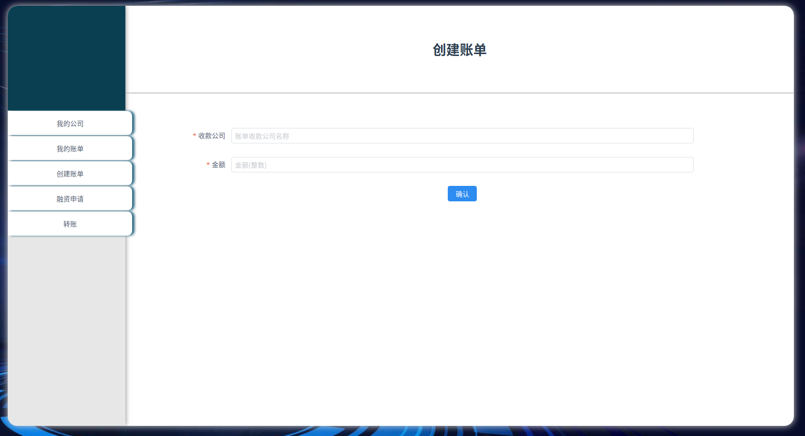

融资申请：

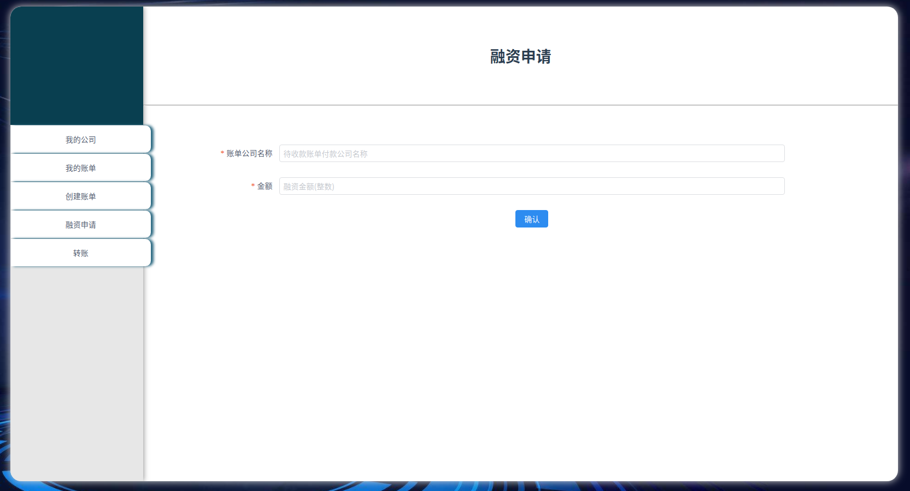

转账：

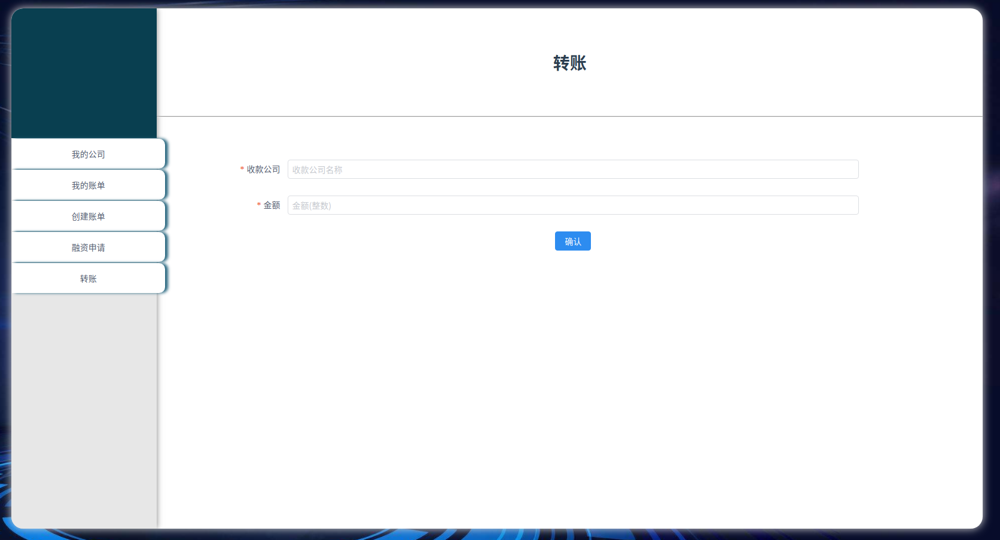


> 对于前端中所有的表单，在提交服务器之前都有先验步骤，检查数值正确性，以及参数存在性等等，如：
>
> 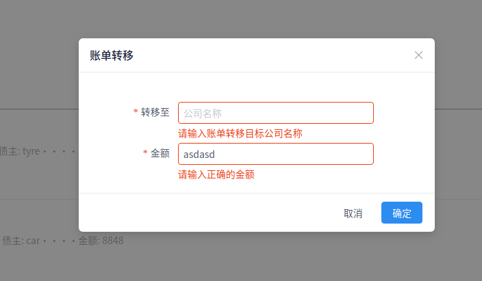
>
> 对于所有操作，提交服务器后都会返回成功与否的提示，方便用户执行功能，如:
>
> 
>
> 

## 功能测试
使用提供的供应链场景类似的场景进行测试。
### 链端合约功能测试(含4大功能)

创建4个用户：
- 银行bank
- 汽车公司法人car
- 轮胎公司法人tyre
- 轮毂公司法人hub
<center><br>创建的4个用户</center><br>
将合约部署到银行上：
<center>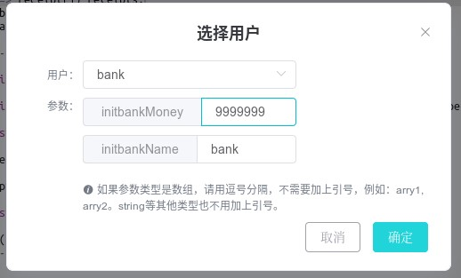<br>部署合约，银行名为bank，资金为9999999</center><br>
注册汽车公司：
<center>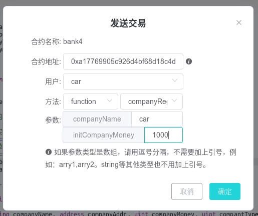<br>注册公司，公司名为car，资金为1000</center><br>
<center>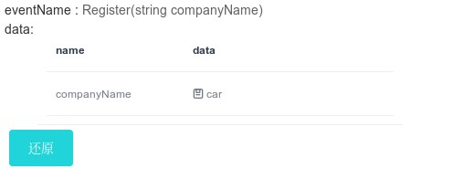<br>产生事件</center><br>
注册轮胎公司：
<center>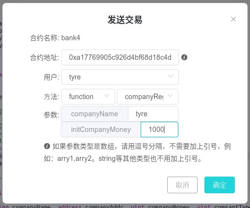<br>注册公司，公司名为tyre，资金为1000</center><br>
<center><br>产生事件</center><br>
注册轮毂公司：
<center>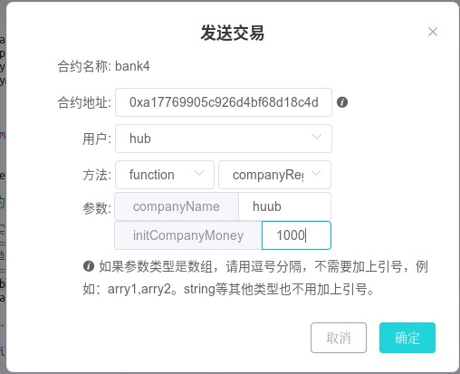<br>注册公司，公司名为huub，资金为1000</center><br>
<center>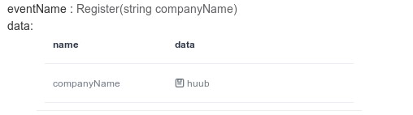<br>产生事件</center><br>
若hub用户重复注册hub公司会出现错误（其他错误类似就不演示了）：
<center>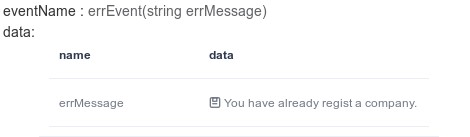<br>产生error事件</center><br>
#### 功能1 创建账单

创建一个账单，汽车公司向轮胎公司购买物品，欠款500，
汽车公司创建账单：
<center>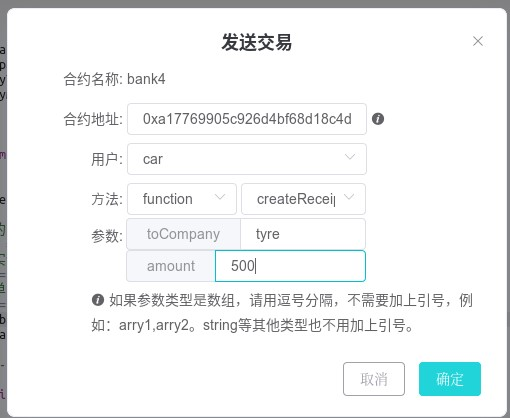<br>创建账单</center><br>
<center>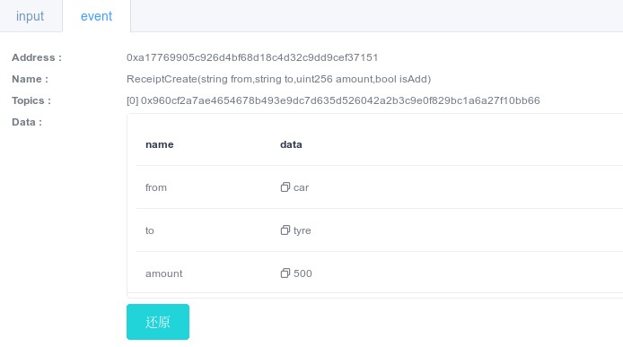<br>创建账单事件</center><br>
汽车公司查看自己的账单：
<center>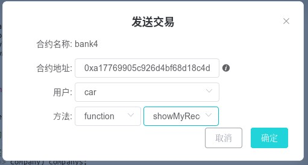<br>查看账单</center><br>
<center>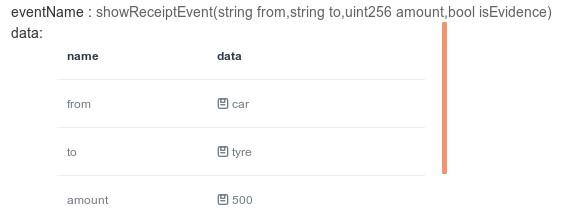<br>输出账单事件</center><br>
轮胎公司查看自己的账单：
<center>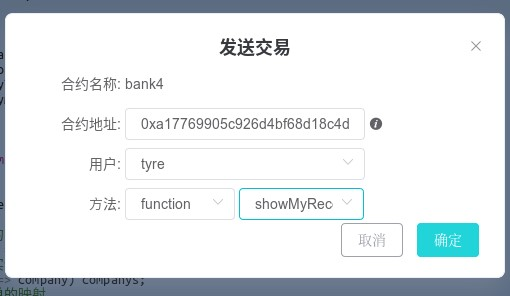<br>查看账单</center><br>
<center>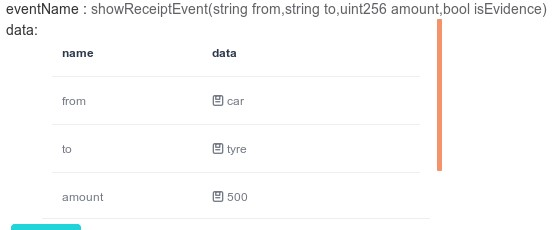<br>输出账单事件</center><br>
可以看到汽车公司和轮胎公司都能看到汽车公司欠款轮胎公司750，功能1实现成功。

#### 功能2 账单转移

账单转移，轮胎公司作为债权人使用这个债券购买轮毂公司商品，使用250，
轮胎公司转移账单：
<center>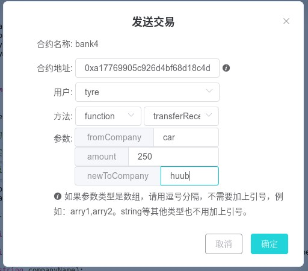<br>账单转移</center><br>
轮胎公司查看自己的账单：
<center>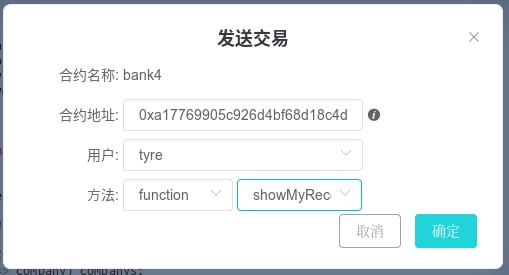<br>查看账单</center><br>
<center>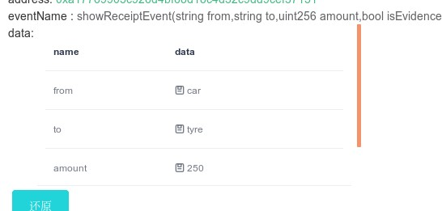<br>输出账单事件</center><br>
轮毂公司查看自己的账单：
<center>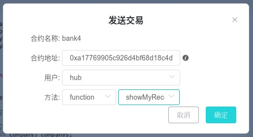<br>查看账单</center><br>
<center>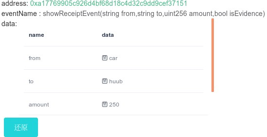<br>输出账单事件</center><br>
汽车公司查看自己的账单
<center>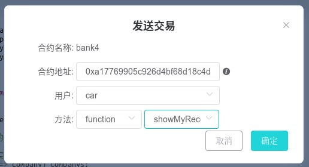<br>查看账单</center><br>
<center>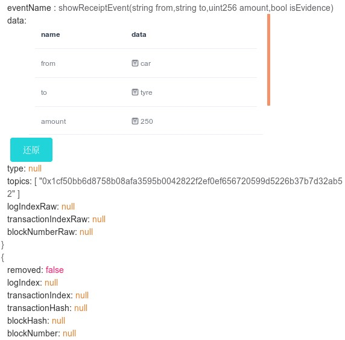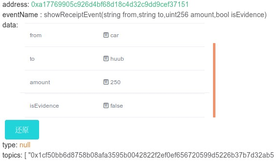<br>输出账单事件（两个event事件，即有两个账单条目</center><br>
可以看到轮毂公司现在持有账单，汽车公司欠其款项250，而轮胎公司的账单变成汽车公司欠其款项250，同时汽车公司的账单变成两个，一个欠轮胎公司250，一个欠轮毂公司250，功能2实现成功。

#### 功能3 银行融资

向银行融资，轮胎公司使用债券中的100，向银行融资100，账户上多100
轮胎公司向银行融资：

<center>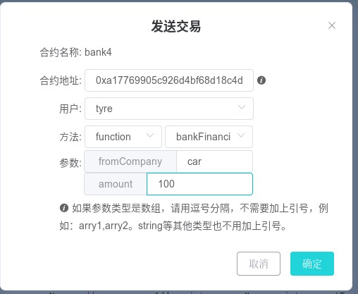<br>向银行融资</center><br>
轮胎公司查看账单：
<center>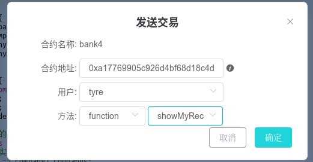<br>查看账单</center><br>
<center>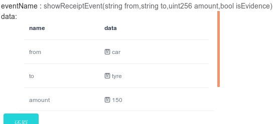<br>输出账单事件</center><br>
轮胎公司查看公司信息（查看余额）：
<center>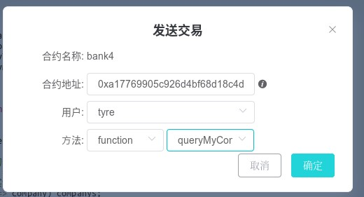<br>查看公司信息</center><br>
<center>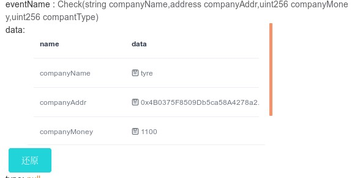<br>公司信息（多了100）</center><br>
汽车公司查看账单：
<center>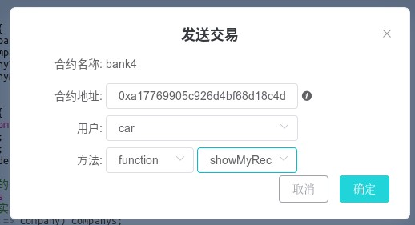<br>查看账单</center><br>
<center><br>输出账单事件（多了欠银行钱的账单）</center><br>
银行查看账单：
<center>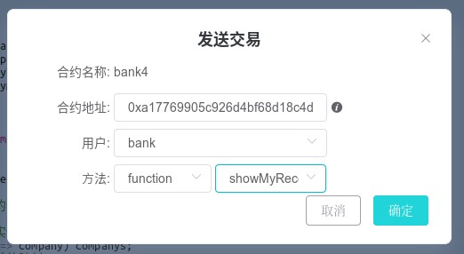<br>查看账单</center><br>
<center>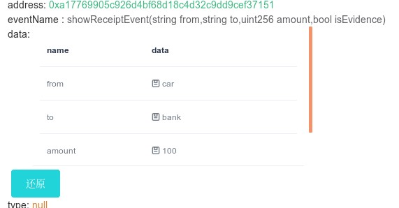<br>输出账单事件</center><br>
银行查看公司信息（查看余额）：
<center>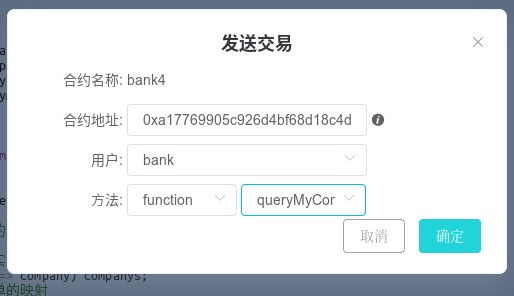<br>查看公司信息</center><br>
<center>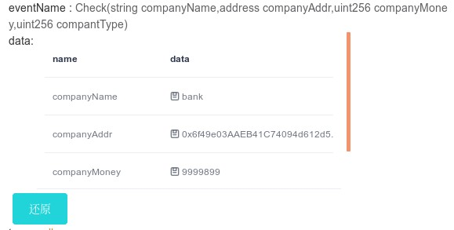<br>公司信息（少了100）</center><br>
可以看到融资后，轮胎公司的账单中显示汽车公司欠的钱款少了100变为150，同时自己账户上多了100元。
银行新持有欠款人为汽车公司的债券，并且账户上少了100。
最后汽车公司的账单中多了一条欠银行欠的条目，功能3实现成功。

#### 功能4 还款

汽车公司还款给轮胎公司50
汽车公司还款：

<center>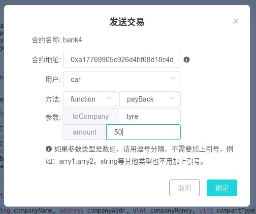<br>还款</center><br>
汽车公司查看账单：
<center>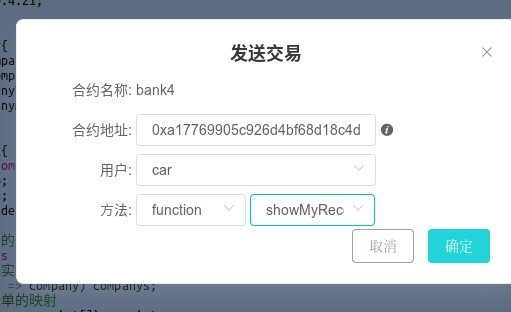<br>查看账单</center><br>
<center>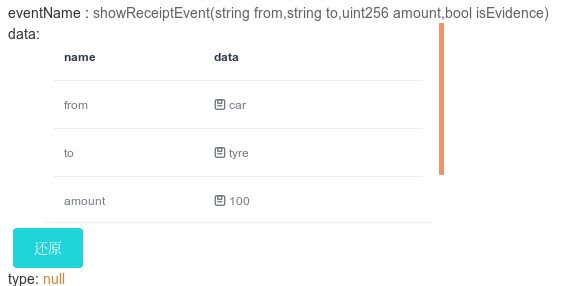<br>输出账单事件</center><br>
轮胎公司查看账单：
<center><br>查看账单</center><br>
<center>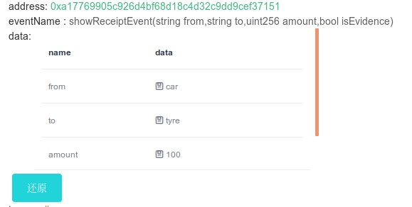<br>输出账单事件</center><br>
可以看到还款后双方账单款项都有所减少，功能4实现成功。

### 前端运行测试

详情见录制视频`应用操作案例.mp4`

## 加分项

前端界面较为干净直观，主页面登陆注册两功能通过一个tab组织起来，较为直观。前端所有的表单数据验证方便用户操作, 公司功能主页分为5个子功能，操作直观。

- 我的公司
- 我的账单
- 创建账单
- 融资申请
- 转账

对于现有账单的操作则集成在我的账单中每一个账单里面，欠款提供还款按钮，外债提供账单转移按钮，避免了用户的误操作，提高效率...

对于所有表单提交操作，若服务器返回错误会全局提示错误信息，方便用户了解错误情况。

## 心得体会

整个大作业涉及了fisco-bocs的链端，以及java后端和vue前端的编写，真全栈作业，虽然其中遇到了很多困难，但最后还是完成了作业，可喜可贺。也体会到区块链应用的宽阔前景，虽然这次因为精力有限，应用还是有很多不尽如人意的地方，但是也正是这次应用的开发体验让我意识到区块链应用的广阔前景。

